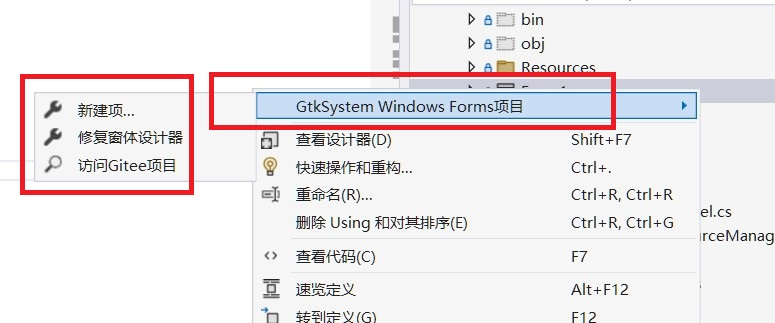

# GTKSystem.Windows.Forms

### Introduction
**Native Visual Studio Development, No Learning Required, Compile Once, Run Cross-Platform**
C# desktop application cross-platform (Windows, Linux, macOS) development framework, based on GTK components. With this framework, Visual Studio can use C#'s native WinForms form designer with the same properties, methods, and events as traditional WinForms development, requiring no additional learning. Compile once and run cross-platform. It facilitates cross-platform WinForms software development and enables upgrading existing C# WinForms applications to cross-platform solutions.

Project website: [https://www.gtkapp.com](https://www.gtkapp.com)

### Software Architecture
Developed using .NET C# and GTK 3.24.24.95 as the UI framework, this system rewrites C#'s `System.Windows.Forms` components, ensuring compatibility with native C# program components.

### Installation Guide
By default, when Visual Studio compiles a project with GtkSharp from NuGet, it automatically downloads the `Gtk.zip` runtime package and extracts it. This open-source project also includes the `Gtk.zip` package for manual installation. Below are three installation methods:

#### 1. Automatic Installation (May Contain Older Libraries)
When you compile your project after installing GtkSharp, it automatically downloads `gtk.zip` and extracts it to the directory `$(LOCALAPPDATA)\Gtk\3.24.24` to configure the GTK environment. However, due to network restrictions in some regions, automatic downloads may fail.
- Alternative download: [https://gitee.com/easywebfactory/GTK-for-Windows/tree/master/Dependencies](https://gitee.com/easywebfactory/GTK-for-Windows/tree/master/Dependencies)
- You can also download `https://github.com/GtkSharp/Dependencies`, extract it, and place it in `$(LOCALAPPDATA)\Gtk\3.24.24`.
- `$(LOCALAPPDATA)` refers to the `AppData\Local` folder, e.g., `C:\Users\YourUser\AppData\Local\Gtk\3.24.24`

#### 2. EXE Installer (Recommended for Latest Libraries)
Downloading and installing the latest libraries using an EXE installer is recommended:
- Download from: [https://gitee.com/easywebfactory/GTK-for-Windows/tree/master/Dependencies](https://gitee.com/easywebfactory/GTK-for-Windows/tree/master/Dependencies)
- Alternative download: [https://github.com/tschoonj/GTK-for-Windows-Runtime-Environment-Installer](https://github.com/tschoonj/GTK-for-Windows-Runtime-Environment-Installer)
- After installation, configure the system environment variables:
  ```bat
  @set GTK3R_PREFIX=C:\Program Files\GTK3-Runtime Win64
  @echo set PATH=%GTK3R_PREFIX%;%%PATH%%
  @set PATH=%GTK3R_PREFIX%;%PATH%

//Using environment variables on Windows may cause exceptions in some cases, such as conflicts with zlib1.dll from Intel WiFi.  
//Intel's environment variable PATH: C:\Program Files\Intel\WiFi\bin\  
//Solution: Rename or delete the file C:\Program Files\Intel\WiFi\bin\zlib1.dll  
//Note: Modifying this file may affect the normal operation of Intel WiFi  
  ```

#### 3. Installation via MSYS (For Latest Libraries)
Use MSYS to install GTK components. Search online for specific steps.

### Installing .NET on Windows
Download the .NET SDK from Microsoft's official website: [https://dotnet.microsoft.com/en-us/download](https://dotnet.microsoft.com/en-us/download)

### Installing GTK on Linux
```bash
# Debian/Ubuntu
sudo apt install gtk3

# Fedora
sudo apt install gtk3       # Binary package
sudo apt install gtk3-devel # Development package

# MSYS2
pacman -S mingw-w64-ucrt-x86_64-gtk3

# Verify installation (requires pkg-config):
pkg-config --cflags --libs gtk+-3.0

# Find GTK installation directory:
ldconfig -p | grep gtk
```

### Installing .NET on Linux
Refer to Microsoft's official guide: [https://learn.microsoft.com/en-us/dotnet/core/install/linux-scripted-manual](https://learn.microsoft.com/en-us/dotnet/core/install/linux-scripted-manual)

### Development Guide
1. **Project Framework Selection:**
   - Choose "Windows Application" and set `UseWindowsForms` to `false`, or select "Console Application" (for .NET 6+).
2. **Install Required NuGet Packages:**
   - `GtkSharp (3.24.24.95)`
   - `GTKSystem.Windows.Forms`
   - `GTKSystem.Windows.FormsDesigner`
3. **Ensure Proper Image Resource Handling:**
   - If using images, create `System.Resources.ResourceManager` and `System.ComponentModel.ComponentResourceManager` (detailed below).
4. **Compile the Project and Fix Form Designer Issues:**
   - Use the built-in "Fix Form Designer" menu option or manually create `designer.runtimeconfig.json` in the `obj` directory.

### Running the Software
1. **On Windows:** Compile and run `demo_app.exe` or `demo_app.dll` in the Debug directory.
2. **On Linux/macOS:** Run `dotnet demo_app.dll`.
3. **Cross-Platform Deployment:** Projects using this framework can be compiled and deployed on Linux, generating a native Linux binary (without a file extension) that can be executed directly.

### Visual Studio Plugin Installation

#### Tool 1: NuGet Installation
Install `GTKSystem.Windows.FormsDesigner` from NuGet to fix form designer issues during compilation.

#### Tool 2: VSIX Plugin Installation
Download the plugin tool, close Visual Studio, and install `GTKAppVSIX.vsix` by double-clicking it. *(Required if the project lacks Form templates.)*

### Features Installed by the Plugin:
1. **Form Templates:** Adds templates for Forms and User Controls under "New Item".
2. **Context Menu:** Adds a right-click menu for project-specific GTKWinForms tasks.



### Project Configuration Steps

#### 1. Create `System.Resources.ResourceManager` Class
- Inherit from `GTKSystem.Resources.ResourceManager` to override native `System.Resources.ResourceManager`.
- Handles reading project resource files and images.
- *(Skip this step if your project does not use resource files/images.)*

#### 2. Create `System.ComponentModel.ComponentResourceManager` Class
- Inherit from `GTKSystem.ComponentModel.ComponentResourceManager`.
- Enables resource and image file reading via `GTKSystem.Resources.ResourceManager`.
- *(Skip this step if unnecessary.)*

#### 3. Modify `GTKWinFormsApp.csproj`
- Set `UseWindowsForms` to `false` in the project file:
  ```xml
  <Project Sdk="Microsoft.NET.Sdk.WindowsDesktop">
    <PropertyGroup>
      <OutputType>WinExe</OutputType>
      <TargetFramework>net8.0</TargetFramework>
      <UseWindowsForms>false</UseWindowsForms>
  ```

#### 4. Add Required References
- **Mandatory:** `GTKSystem.Windows.Forms`

#### 5. [Optional] Create and add the configuration file Directory.Build.props.  
This configuration is designed to distinguish the obj directories of form design projects,
<b>This configuration is primarily designed for the dual-engineering approach</b>, where C# native form projects manage forms. The project demonstration employs this method. For detailed usage tutorials, visit https://www.gtkapp.com/formsdesigner
<br/><br/>The configuration is as follows:
```
<Project>
	<PropertyGroup>
		<BaseIntermediateOutputPath>obj\$(MSBuildProjectName)</BaseIntermediateOutputPath>
		<IntermediateOutputPath>$(BaseIntermediateOutputPath)\$(TargetFramework)</IntermediateOutputPath>
	</PropertyGroup>
</Project>
```

### Support and Resources
- **Enterprise Services:** [https://www.gtkapp.com/vipservice](https://www.gtkapp.com/vipservice)


### Communication/Business 
QQ Group: 1011147488  
Email: 438865652@qq.com 

### Common Issues
**Why Can't I Open the Form Designer?**

For detailed methods, please visit[ https://www.gtkapp.com/formsdesigner/ ]( https://www.gtkapp.com/formsdesigner/ 밀.

There are three ways to use a form designer:

1밀 Install GTK System. Windows. Forms Designer from VNet, install the Visual Studio plugin from the project download package, recompile the project, and fix the form designer.   
2밀 Switch to the native Net framework Windows application project, include the relevant form interface files in the project, and you can use the form designer.   
3밀 Switch to a Windows application project with a framework framework and include the relevant form interface files in the project to use the form designer. 

### Contribution
Contribute to this framework at:
1. https://www.gtkapp.com
2. https://gitee.com/easywebfactory
3. https://github.com/easywebfactory

### Update History
For detailed updates, visit: [Update History >>](UpdateHistory.md)

