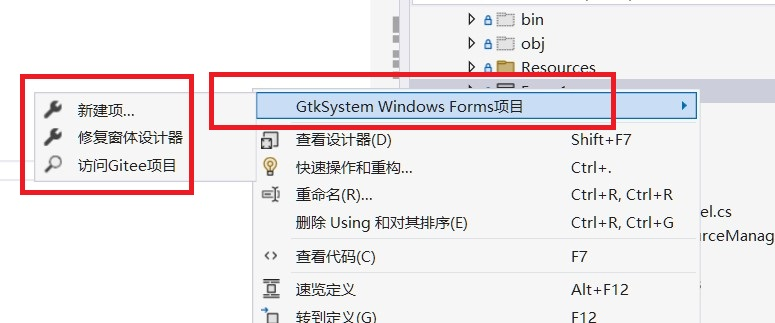

# GTKSystem.Windows.Forms

### 介绍
**Visual Studio原生开发，无需学习，一次编译，跨平台运行**.
C#桌面应用程序跨平台（windows、linux、macos）界面开发组件，基于GTK组件开发，该组件的核心优势是使用C#的原生winform表单控件窗体设计器，相同的属性方法，C#原生开发即可，无需学习。一次编译，跨平台运行。
便于开发跨平台winform软件，便于将C#升级为跨平台软件。

项目官网：[https://www.gtkapp.com](https://www.gtkapp.com/)   
博客：[https://www.cnblogs.com/easywebfactory](https://www.cnblogs.com/easywebfactory)


目前功能持续更新中，将优先完善常用功能。

### 软件架构

使用GTK3.24.24.95作为表单UI重写C#的System.Windows.Forms组件，在应用时，兼容原生C#程序组件。

### 安装教程
1.  项目工程框架选择“window应用程序”改配置UseWindowsForms为false或“控制台应用程序”，框架.netcore3.1或.net6及以上版本
2.  NulGet安装GtkSharp(3.24.24.95)、GTKSystem.Windows.Forms、GTKSystem.Windows.FormsDesigner
3.  检查form表单是否有使用图像资源，如使用需新建System.Resources.ResourceManager和System.ComponentModel.ComponentResourceManager，具体请看下面内容。
4.  按默认配置编译发布测试运行
5.  linux和macos上执行命令：dotnet demo_app.dll
6.  编译工程，执行本项目的开发插件菜单“修复窗体设计器”，或者手动在obj目录下创建.designer.runtimeconfig.json，请看下面第5点。

注意：安装GtkSharp后，编译你的工程项目时，会自动下载$(LOCALAPPDATA)\Gtk\3.24.24\gtk.zip配置Gtk环境，目前国内网络限制，可能会出现无法下载的错误。
如果无法自动下载，本项目提供下载 [/Dependencies/gtk-3.24.24.zip](/Dependencies/gtk-3.24.24.zip)。
也可以下载[https://github.com/GtkSharp/Dependencies](https://github.com/GtkSharp/Dependencies)，把文件解压后放到$(LOCALAPPDATA)\Gtk\3.24.24\gtk.zip目录即可。
  ps: $(LOCALAPPDATA)为电脑的AppData\Local文件夹,如：C:\Users\chj\AppData\Local\Gtk\3.24.24

linux安装gtk环境：
```
 sudo apt install libgtk-3-dev
 或
 sudo apt-get install libgtk3*
```
linux安装dotnet环境：
```
  安装方法可以查看微软官网教程：https://learn.microsoft.com/zh-cn/dotnet/core/install/linux-scripted-manual
```
### VisualStudio插件安装

工具一、从NuGet上安装GTKSystem.Windows.FormsDesigner类库，此类库可以在编译工程时修正窗体设计器。

工具二、下载本插件工具，关闭visual studio，直接双击GTKWinformVSIXProject.vsix文件安装（本框架下的工程，Studio没有添加Form模板项，需要安装此插件）

插件会安装两个功能：

1、新建项的Form窗体模板、用户控件模板。

2、工程右键菜单。



### 开发教程及说明

以下配置在你的项目工程里操作：

1、新建System.Resources.ResourceManager类<br/>
在项目下新建System.Resources.ResourceManager类，继承GTKSystem.Resources.ResourceManager，用于覆盖原生System.Resources.ResourceManager类。
GTKSystem.Resources.ResourceManager实现了项目资源文件和图像文件读取。
如果项目里没有使用资源图像文件，可以不用新建此文件。

2、新建System.ComponentModel.ComponentResourceManager类<br/>
在项目下新建System.ComponentModel.ComponentResourceManager类，继承GTKSystem.ComponentModel.ComponentResourceManager，用于覆盖原生System.ComponentModel.ComponentResourceManager类。<br/>
GTKSystem.ComponentModel.ComponentResourceManager实现了项目资源文件和图像文件读取（调用GTKSystem.Resources.ResourceManager）。
如果项目里没有使用资源图像文件，可以不用新建此文件。

3、GTKWinFormsApp.csproj<br/>
配置UseWindowsForms为false，目标OS设置为“(空)”，或者使用控制台应用程序(在控制台框架下会显示控制台窗口，不建议这种方式)
```
<Project Sdk="Microsoft.NET.Sdk.WindowsDesktop">
  <PropertyGroup>
    <OutputType>WinExe</OutputType>
    <TargetFramework>net8.0</TargetFramework>
    <UseWindowsForms>false</UseWindowsForms>
```

4、引用GTKSystem.Windows.Forms、System.Resources.Extensions <br/>
GTKSystem.Windows.Forms是必须引用<br/>
System.Resources.Extensions是空程序dll，不是必须引用，只有VS在窗体设计器出现相关异常提示时使用

5、GTKWinFormsApp\obj\Debug\net8.0\GTKWinFormsApp.designer.runtimeconfig.json
GTKWinFormsApp\obj\Debug\net8.0\GTKWinFormsApp.runtimeconfig.json
将name设置为Microsoft.WindowsDesktop.App， **用于VS支持可视化窗体设计器，重新加载工程或重启VS** 
如以下配置：
GTKWinFormsApp.designer.runtimeconfig.json
```
{
  "runtimeOptions": {
    "tfm": "net8.0",
    "framework": {
      "name":"Microsoft.WindowsDesktop.App",
      "version": "8.0.0"
    },
    "additionalProbingPaths": [
      "C:\\Users\\chj\\.dotnet\\store\\|arch|\\|tfm|", 
      "C:\\Users\\chj\\.nuget\\packages",
      "C:\\Program Files (x86)\\Microsoft Visual Studio\\Shared\\NuGetPackages",
      "C:\\Program Files\\dotnet\\sdk\\NuGetFallbackFolder"
    ],
    "configProperties": {
      "System.Runtime.Serialization.EnableUnsafeBinaryFormatterSerialization": false,
      "Microsoft.NETCore.DotNetHostPolicy.SetAppPaths": true
    }
  }
}
```

GTKWinFormsApp.runtimeconfig.json
```
{
  "runtimeOptions": {
    "tfm": "net8.0",
    "framework": {
      "name": "Microsoft.WindowsDesktop.App",
      "version": "8.0.0"
    },
    "configProperties": {
      "System.Runtime.Serialization.EnableUnsafeBinaryFormatterSerialization": false
    }
  }
}
```

### Resources资源的使用
* [查看Resources资源的使用教程>>](Readme_Resources.md)

### 默认风格效果


### 默认风格工具栏菜单


### 图文窗口


### 支持各种主题风格界面（windows xp、vista、7、8、10，macOS系列，等等）

#### 主题风格，windows7风格界面

#### 主题风格，window10黑色风格界面

#### 主题风格，macOS风格界面


### 支持GTKSystem，获取技术服务

| ￥299基础服务一   | ￥2999套餐服务二    | ￥9999套餐服务三     |
| :----               |    :----           |          :----   |
| 帮助开发环境安装       | 包括套餐一服务        |   包含所有套餐服务  |
| 运行环境gtk\dotnet安装 | 提供二次开发技术支持  |   提供二次开发技术支持    |
| 上手开发疑难解答       | 为用户开发协商指定的功能或接口至少3项 | 为用户开发功能或接口不少于9项  |
| 提供应用开发技术支持      | 提供定制的主题风格界面样式和一些常用扩展控件    |  提供定制的主题风格界面样式和一些常用扩展控件                           |

 
 

### 交流/合作/商务/赞助
QQ群：236066073
邮箱：438865652@qq.com <br/>

### 常见问题
  为什么Form窗体设计器打不开？<br/>
  ```
  答：检查runtimeconfig确保配置正确，通过NuGet安装GTKSystem.Windows.FormsDesigner，然后按以下流程操作：
    1、编译一下 
    2、打开Form窗体
    （如果不能打开窗体，执行下面流程） 
    3、关闭Form窗体，编译一下 
    4、重启Visual Studio 
    5、打开Form窗体设计器 
 ```
### 参与贡献

1. https://gitee.com/easywebfactory
2. https://github.com/easywebfactory
3. https://blog.csdn.net/auto_toyota

### 更新记录
* [查看更新记录>>](UpdateHistory.md)