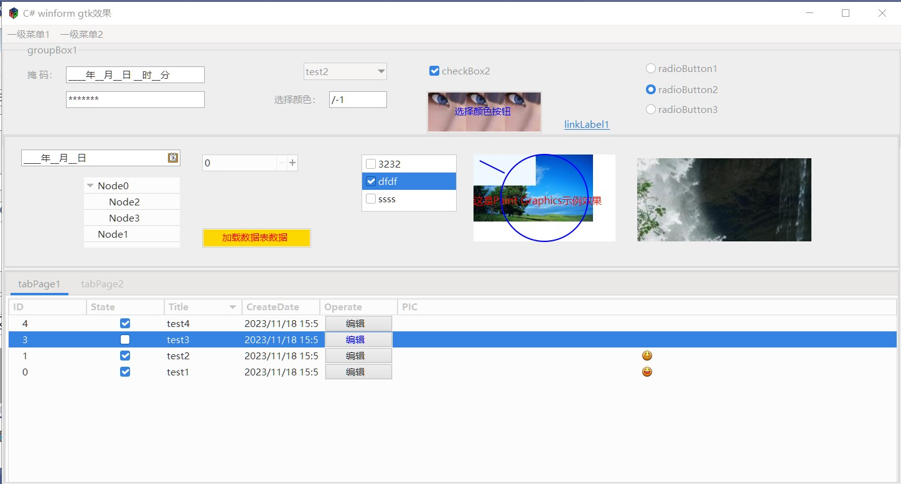
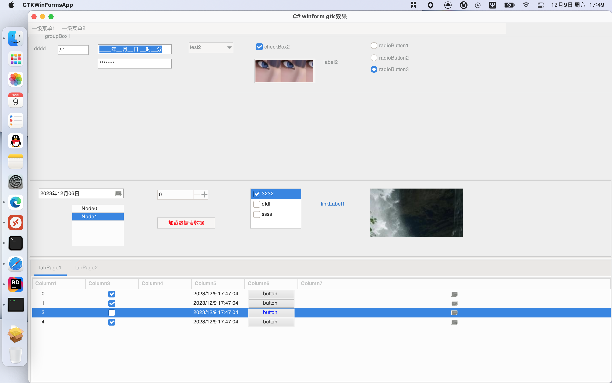
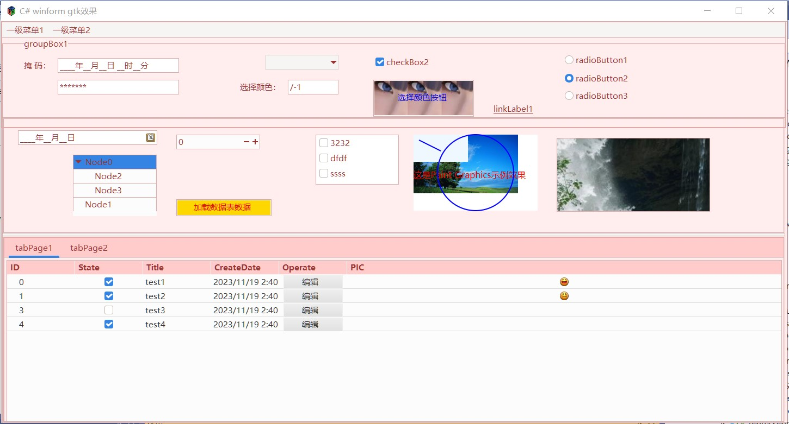
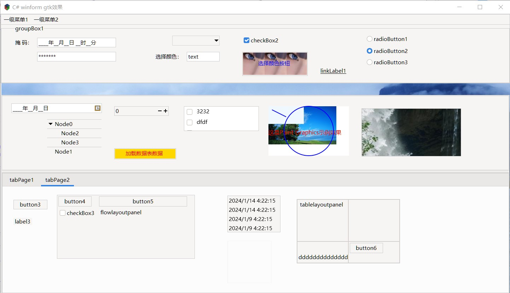

# GTKSystem.Windows.Forms

#### 介绍
**Visual Studio原生开发，无需学习，一次编译，跨平台运行**.
这是基于GTK3.24.24框架组件开发的跨平台（windows、linux、macos）C#桌面应用程序表单界面组件，该组件的核心优势是使用C#的原生表单控件和属性方法，C#原生开发即可，无需学习。
便于开发跨平台winform软件，便于将C#升级为跨平台软件。

作者博客请看 [https://www.cnblogs.com/easywebfactory/p/17803567.html](https://www.cnblogs.com/easywebfactory/p/17803567.html)

#### 软件架构

使用GTK3.24.24作为GDI，重写C#的System.Windows.Forms组件，在应用时，兼容原生C#程序组件。

#### 安装教程

这是.net8.0版本的项目工程，如你有需要net8.0以下版本，可以选择分支“netcore3.1版”下载。
1.  把项目工程改为“控制台应用程序”或者配置UseWindowsForms为false
2.  NulGet安装GtkSharp(3.24.24.34)
3.  引用Libs目录下的GTKSystem.Windows.Forms.dll和System.Resources.Extensions.dll
4.  编译发布测试运行
5.  linux和macos上执行命令：dotnet GTKWinFormsApp.dll

#### 使用说明

以下配置在你的项目工程里操作：

1、新建System.Resources.ResourceManager类<br/>
在项目下新建System.Resources.ResourceManager类，继承GTKSystem.Resources.ResourceManager，用于覆盖原生System.Resources.ResourceManager类。
GTKSystem.Resources.ResourceManager实现了项目资源文件和图像文件读取。
如果项目里没有使用资源图像文件，可以不用新建此文件。

2、新建System.ComponentModel.ComponentResourceManager类<br/>
在项目下新建System.ComponentModel.ComponentResourceManager类，继承GTKSystem.ComponentModel.ComponentResourceManager，用于覆盖原生System.ComponentModel.ComponentResourceManager类。<br/>
GTKSystem.ComponentModel.ComponentResourceManager实现了项目资源文件和图像文件读取（调用GTKSystem.Resources.ResourceManager）。
如果项目里没有使用资源图像文件，可以不用新建此文件。

3、GTKWinFormsApp.csproj<br/>
配置UseWindowsForms为false，或者使用控制台应用程序
```
<UseWindowsForms>false</UseWindowsForms>
```

4、引用GTKSystem.Windows.Forms、System.Resources.Extensions <br/>
System.Resources.Extensions是空程序dll，VS加载Form界面时验证需要此dll.

5、GTKWinFormsApp\obj\Debug\net8.0\GTKWinFormsApp.designer.runtimeconfig.json
GTKWinFormsApp\obj\Release\net8.0\GTKWinFormsApp.designer.runtimeconfig.json
将name设置为Microsoft.WindowsDesktop.App， **用于VS支持可视化窗体设计器，重新加载工程或重启VS** 

```
   "runtimeOptions": {
     "framework": {
      "name": "Microsoft.WindowsDesktop.App"
    },

```
#### demo效果

#### mac运行效果

#### 颜色主题

#### 窗口背景

#### 交流
QQ群：236066073

#### 参与贡献

1. https://gitee.com/easywebfactory/


